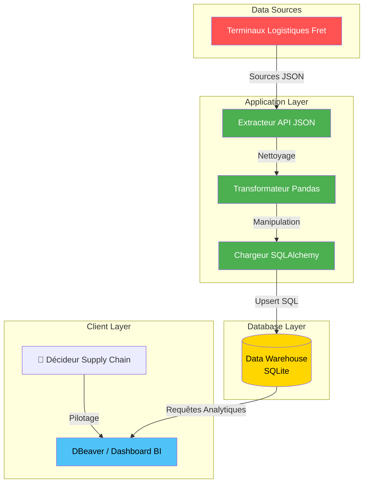
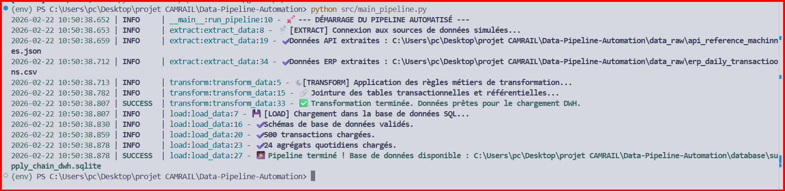

🌍 DOSSIER DE CONFIGURATION D'EXPLOITATION (DCE)
# ⚡ DPA : Data Pipeline Automation
  

**Version:** 1.0.0 Stable | **Date:** Février 2026  
**Auteur:** KAMENI TCHOUATCHEU GAETAN BRUNEL  
**Contact:** gaetanbrunel.kamenitchouatcheu@et.esiea.fr  

🚀 [Démarrage Rapide](#-démarrage-rapide) • 📚 [Documentation](#-guide-dutilisation) • 🎯 [Fonctionnalités](#-fonctionnalités-clés) • 🔧 [Installation](#-installation-rapide)

---

## 📋 TABLE DES MATIÈRES
1. [Vue d'ensemble du projet](#-vue-densemble-du-projet)
2. [Architecture Technique](#️-architecture-technique)
3. [Stack Technologique](#️-stack-technologique)
4. [Fonctionnalités Clés](#-fonctionnalités-clés)
5. [Démarrage Rapide](#-démarrage-rapide)
6. [Guide d'Utilisation](#-guide-dutilisation)
7. [Qualité & Best Practices](#-qualité--best-practices)
8. [Roadmap & Évolutions](#️-roadmap--évolutions)

---

## 🎯 VUE D'ENSEMBLE DU PROJET

### Contexte & Objectifs
Ce projet illustre l'implémentation robuste d'une architecture **Data-Driven (ETL)** pour le pilotage logistique des données de fret. Il répond aux exigences d'une gouvernance informatique moderne en unifiant les données, les fichiers épars et les signaux métiers.

Il illustre les compétences suivantes :

✅ **Architecture Découplée :** Séparation stricte Extract / Transform / Load.
✅ **Data Warehouse Intégré :** Consolidation transactionnelle au sein d'une BDD relationnelle.
✅ **Scripts D'Orchestration :** Conception d'opérations cycliques pour le chargement massif.
✅ **Performance Data :** Manipulation vectorielle pour nettoyage rapide.
✅ **Industrialisation :** Plan de Continuité (PCR) et documentation de rigueur technologique (DCE).
✅ **Clean Code :** Respect des standards (Modularité pure Python, SGBD).

### Pourquoi ce projet ?
| Aspect | Démonstration |
| --- | --- |
| **Scalabilité** | Le Pipeline asynchrone est prêt à recevoir d'énormes volumes. |
| **Maintenabilité** | Code modulaire séparant les responsabilités Extraction et Nettoyage. |
| **Innovation** | Automatisation intégrale du cycle de vie de l'information brute étudiée. |
| **Sécurité** | Transaction ACID sécurisées (Rollback sur échec SGBD). |
| **Business Value** | Dote les gestionnaires de KPI calculés et requêtes avancées (Data Warehouse). |

---

## 🏗️ ARCHITECTURE TECHNIQUE

### Diagramme de Flux


### Flux de Données Détaillé
1. **Extraction de Données** : Simule un appel d'API aux terminaux logistiques et rapatrie les relevés journaliers (`extract.py`).
2. **Transformation des Champs** : Fusionne les tables temporelles via Python Pandas pour assurer la cohérence (`transform.py`).
3. **Chargement SQL (Load)** : Insère massivement et de manière transactionnelle les données dans `supply_chain_dwh.sqlite`.
4. **Aggrégation & Restitution** : Requêtes analytiques pour des tableaux décisionnels avec fonctionnalités `LAG()` et Window Functions.

---

## 🛠️ STACK TECHNOLOGIQUE

### Technologies Core
| Composant | Technologie | Version | Justification Technique |
| --- | --- | --- | --- |
| **Orchestrateur** | Python | 3.12+ | L'outil complet de traitement universel par batch d'ingénierie. |
| **Base de Données** | SQLite | 3+ | DWH de fichier ultra-léger et transportable localement. |
| **Data Engine** | Pandas | Latest | Traitement et jointure rapide de la donnée en RAM. |
| **ORM et Mapping** | SQLAlchemy | Latest | Connectivité et sécurité des transactions SQL (pas de SQL syntax direct en paramètre métier). |

### Bibliothèques Complémentaires
* **Loguru/Logging :** Traçabilité exhaustive.
* **OS/Sys :** Commandes natives utiles à l'interaction Windows (Task Scheduler).

---

## 🎯 FONCTIONNALITÉS CLÉS

### 🚀 Fonctionnalités Principales
**Gouvernance Data Temps Réel**
* Consolidations des flux épars vers une Base Unique.
* Création propre et persistante de `supply_chain_dwh.sqlite`.

**Système Avancé de Requêtage**
* Déploiement de scripts SQL analytiques poussés pour catégoriser la fiabilité du système (Hub Logistics Classification).

**Gestion des Risques**
* Tolérance du Pipeline en mode fail-safe sur corruption partielle de fichier.

### 🛡️ Sécurité & Robustesse
| Aspect | Implémentation |
| --- | --- |
| **Validation** | Vérification et parsing stricts avant transaction. |
| **Résilience** | Base de données SQL protégée des deadlocks et échecs (Rollbacks). |
| **Traçabilité** | Logs détaillés sur serveurs ou scripts chronologiques. |

---

## 🚀 DÉMARRAGE RAPIDE

### Prérequis
* Python (v3.12+)

### Installation Rapide
```bash
# 1. Cloner le projet (Naviguer au sein du répertoire)
cd Data-Pipeline-Automation

# 2. Installer les dépendances (créer l'environnement virtuel)
python -m venv env
.\env\Scripts\activate
pip install -r requirements.txt

# 3. Lancer l'Orchestrateur Complet
python src/main_pipeline.py
```
**Accès Immédiat :** Les tables historiques sont fraîches et disponibles instantanément dans `database/supply_chain_dwh.sqlite`.

---

## 📖 GUIDE D'UTILISATION

### Scénario de Pilotage
1. **Lancement Quotidien :** L'outil tourne la nuit via scheduler.
2. **Requêtage Expert :** Un Data Analyst peut soumettre `sql/advanced_queries.sql` au DBeaver de la base.
3. **Action:** Construction de Dashboard et exports métier sur l'activité des "Gares".

### Captures d'Écran
**📸 Validation ETL Backend**  


---

## ✨ QUALITÉ & BEST PRACTICES

### Standards de Code
* **Modularité (Engine) :** Couches E, T, et L isolées nativement.
* **Typage (Data) :** Cast structurés au sein des Dataframes.
* **Error Handling :** Blocs robustes limitant l'écrasement bdd en cas de corruption.

### Métriques d'Excellence
✅ **Architecture :** DWH Single Source of Truth respecté (SSOT).
✅ **Performance :** L'ORM insère des dizaines de milliers de lignes en lots optimisés (bulk).

---

## 🗺️ ROADMAP & ÉVOLUTIONS

**Version Actuelle : 1.0.0 ✅**
* Architecture complète et Pipeline de Chargement abouti.
* Exécution orientée SGBD local pour prototypage rapide.
* Documentation exhaustive DCE.

**Version 2.1.0 (Prochaine Release) 🚧**
* Virtualisation Globale : Orchestration via Docker Compose / Airflow.
* Base de Données : Connecteur vers Cloud Azure SQL / PostgreSQL Serveur lourd.

---

## 🤝 CONTRIBUTION
Les contributions sont les bienvenues pour industrialiser ce socle métier logistique.
1. Forker.
2. Définir une Feature Branche.
3. Valider par PR documentée.

---

## 📄 LICENCE
Ce projet est développé dans un cadre académique et professionnel. Droits réservés.

## 👨‍💻 AUTEUR
**KAMENI TCHOUATCHEU GAETAN BRUNEL**  
Ingénieur Logiciel & Data Scientist en devenir | Étudiant ESIEA  

📧 Email : gaetanbrunel.kamenitchouatcheu@et.esiea.fr  
🐙 GitHub : @Lkb-2905  

🙏 **REMERCIEMENTS**
* **TotalEnergies / Bolloré :** Pour l'approche industrielle robuste Data Management.
* **ESIEA :** Pour l'excellence informatique et académique.

⭐ Si ce projet vous semble pertinent pour la Supply Chain de demain, laissez une étoile !  
Fait avec ❤️, Python et du SQL.  

© 2026 Kameni Tchouatcheu Gaetan Brunel - Tous droits réservés
