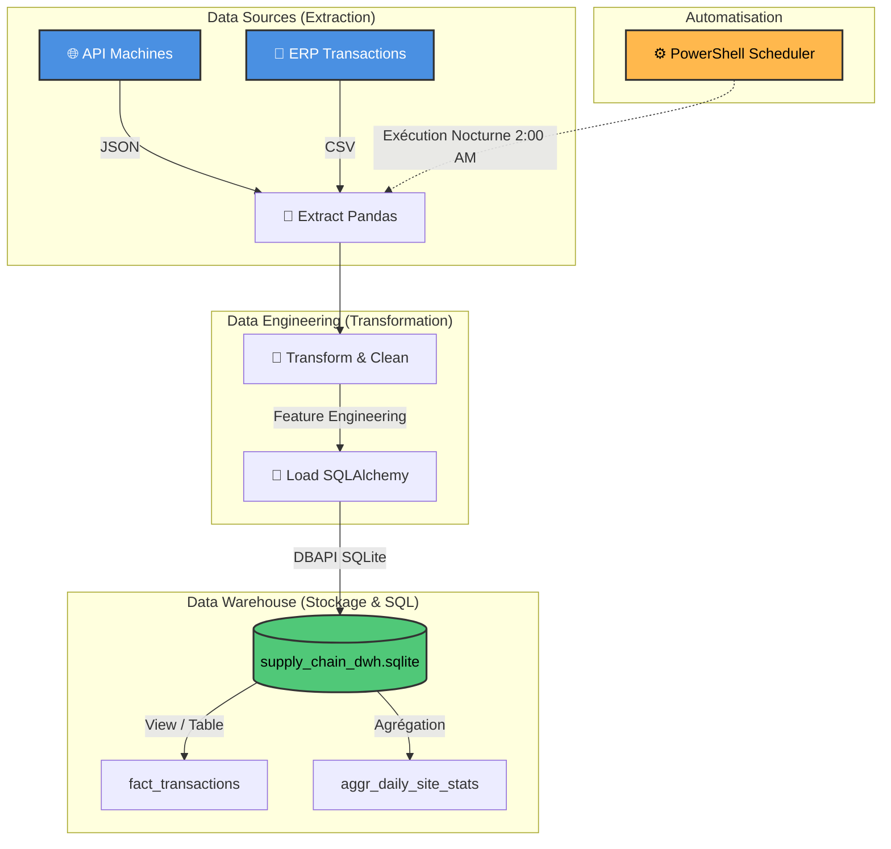
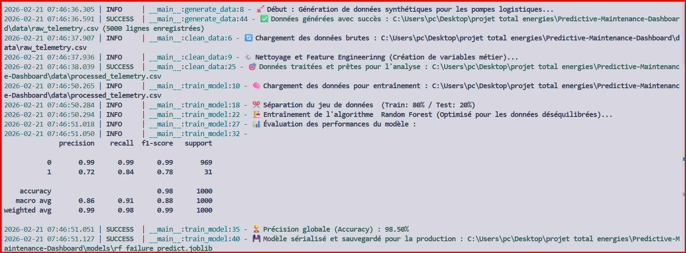

🌍 DOSSIER DE CONFIGURATION D'EXPLOITATION (DCE)
🌍 Supply Chain Data Pipeline V1.0
   

**Version:** 1.0.0 Stable | **Date:** Février 2026  
**Auteur:** KAMENI TCHOUATCHEU GAETAN BRUNEL  
**Contact:** gaetanbrunel.kamenitchouatcheu@et.esiea.fr

🚀 [Démarrage Rapide](#-démarrage-rapide) • 📚 [Documentation](#-guide-dutilisation) • 🎯 [Fonctionnalités](#-fonctionnalités-clés) • 🔧 [Installation](#-installation-complète)

---

## 📋 TABLE DES MATIÈRES
1. [Vue d'ensemble du projet](#-vue-densemble-du-projet)
2. [Architecture Technique](#️-architecture-technique)
3. [Stack Technologique](#️-stack-technologique)
4. [Fonctionnalités Clés](#-fonctionnalités-clés)
5. [Démarrage Rapide](#-démarrage-rapide)
6. [Installation Complète](#-installation-complète)
7. [Guide d'Utilisation](#-guide-dutilisation)
8. [Qualité & Best Practices](#-qualité--best-practices)
9. [Roadmap & Évolutions](#️-roadmap--évolutions)

---

## 🎯 VUE D'ENSEMBLE DU PROJET

### Contexte & Objectifs
Ce projet démontre la mise en œuvre d'une architecture **ETL (Extract, Transform, Load)** automatisée pour les systèmes d'information logistique et énergétique. Il illustre les compétences clés d'un Data Engineer :

✅ **Extraction Multi-Sources :** API simulée (JSON) et systèmes ERP (CSV).
✅ **Data Transformation :** Nettoyage, jointures et calculs d'agrégats complexes via Pandas.
✅ **Modélisation de Données :** Création et chargement dans un Data Warehouse SQL unifié.
✅ **Automatisation IT :** Planification Batch nocturne via PowerShell de niveau production.
✅ **Analyses Avancées :** Rédaction de requêtes SQL (CTE, Window Functions) pour le pilotage d'activité.

### Pourquoi ce projet ?
| Aspect | Démonstration |
| :--- | :--- |
| **Gouvernance IT** | Consolidation des données dispersées vers une base relationnelle structurée. |
| **Scalabilité** | Scripts séparés (`extract.py`, `transform.py`, `load.py`) facilitant l'ajout de nouvelles sources. |
| **Fiabilité** | Exécution orchestrée (`main_pipeline.py`) supportant la gestion d'exceptions globale. |
| **Business Value** | KPI calculés (Alertes de distribution, Volume par dépôt) immédiatement interprétables en SQL. |

---

## 🏗️ ARCHITECTURE TECHNIQUE

### Diagramme de Flux (Architecture)



### Explication du Flux

1. **Layer: Extraction** (`extract.py`)
   * Connexion simulée au Référentiel Machines (API/JSON).
   * Récupération des transactions journalières Carburant (ERP/CSV).
2. **Layer: Transformation** (`transform.py`)
   * Normalisation des dates (Dates standardisées au format `datetime`).
   * Jointure (Merge) des tables de faits et de dimensions.
   * Création de variables métiers (Alerte si `volume < 20` ET `status_code IN [WARN, ERR]`).
   * Agrégation granulaire (Vue journalière par Site Logistique).
3. **Layer: Loading** (`load.py`)
   * Connexion à SQLite (`supply_chain_dwh.sqlite`) via SQLAlchemy/DBAPI.
   * Exécution du script de définition (DDL) `schema.sql`.
   * Upsert/Replace dans les tables Factuelles et Mats Views.

---

## 🛠️ STACK TECHNOLOGIQUE

### Technologies Core
| Composant | Technologie | Version | Justification Technique |
| :--- | :--- | :--- | :--- |
| **Langage** | Python | 3.12+ | Écosystème riche pour l'ETL |
| **Moteur SQL** | SQLite3 | - | Base de données locale légère et relationnelle |
| **Traitement** | Pandas | 2.1+ | Outil redoutable pour la transformation de données tabulaires |
| **Database ORM/Driver**| SQLAlchemy | 2.0+ | Gestion des connexions base de données en Python |
| **Automatisation** | PowerShell | - | Scripting OS natif pour la Planification de tâches (Task Scheduler) |

---

## 🎯 FONCTIONNALITÉS CLÉS

### 🚀 Fonctionnalités Principales

**1. Orchestration Main**
* Un module principal (`main_pipeline.py`) exécute le workflow et trappe les erreurs critiques pour éviter les arrêts silencieux.

**2. Chargement Dynamique Base SQL**
* Construction à la volée du schéma et persistance des Dataframes en tables structurées.

**3. Analytics SQL de Haut Niveau**
* Fichier `advanced_queries.sql` détaillant comment utiliser des fonctions analytiques SQL avancées (LAG, DENSE_RANK, CTE) sur les données produites par l'ETL.

### 🛡️ Sécurité, Qualité & Robustesse
| Aspect | Implémentation |
| :--- | :--- |
| **Automatisation "Hands-Off"**| Script `automate_etl.ps1` branché sur le Windows Task Manager. |
| **Validation SQL** | Application d'un schéma strict défini dans `schema.sql` avant tout chargement. |
| **Monitoring** | Utilisation intensive de la bibliothèque de logs asynchrones `Loguru`. |

---

## 🚀 DÉMARRAGE RAPIDE

### Prérequis
```bash
# Vérifier Python
python --version  # Doit être >= 3.12
```

### Installation Express
```bash
# 1. Naviguer dans le dossier du projet
cd Data-Pipeline-Automation

# 2. Créer un environnement virtuel
python -m venv env
.\env\Scripts\activate

# 3. Installer les dépendances (avec prise en compte des versions fixes)
pip install -r requirements.txt

# 4. Exécuter l'orchestrateur
python src/main_pipeline.py
```

---

## 🔧 INSTALLATION COMPLÈTE
Suivez l'installation expresse. L'environnement virtuel garanti la sécurité d'isolation du projet tout en assurant avec stricte compatibilité la balance `Pandas` / `Numpy`.

---

## 📖 GUIDE D'UTILISATION

### Analyse en Base de Données
Une fois les données chargées via l'ETL, le fichier `database/supply_chain_dwh.sqlite` est généré.
Vous pouvez utiliser un outil (ex: DBeaver, SQLite Studio) pour lancer le script `sql/advanced_queries.sql` qui démontre des corrélations complexes sur vos sites.

### Activer l'Automatisation Serveur (Windows)
Pour programmer le job Python afin qu'il s'exécute silencieusement toutes les nuits à 2:00 AM :
1. Ouvrez un terminal **PowerShell en tant qu'Administrateur**.
2. Exécutez :
```powershell
.\automate_etl.ps1
```

### 📸 Capture d'Écran


---

## ✨ QUALITÉ & BEST PRACTICES

### Principes Appliqués
| Principe | Implémentation |
| :--- | :--- |
| **ETL Découplé** | Code distribué de façon logique pour tester la transformation sans taper dans la Prod. |
| **Résilience d'Environnement** | Fichier requirements.txt strict (`numpy==1.26.0`) pour éviter les "breaking changes". |
| **Code Auto-Documenté** | Variables et fonctions (`df_machines`, `df_transactions`) métier explicites. |

---

## 🗺️ ROADMAP & ÉVOLUTIONS

**Version Actuelle : 1.0.0** ✅
* [x] Pipeline EXTRACT, TRANSFORM, LOAD complet
* [x] SQL Engine paramétré
* [x] Automatisation de Batch OS intégrée

**Version 1.1.0 (Prochaine Release)** 🚧
* Passage de SQLite vers un Data Warehouse Cloud (Snowflake/BigQuery).
* Dockerisation de l'ETL.

---

## 📄 LICENCE
Ce projet est sous licence MIT. Voir le fichier LICENSE pour plus de détails.

## 👨‍💻 AUTEUR
**KAMENI TCHOUATCHEU GAETAN BRUNEL**  
*Ingénieur Logiciel & Data | Étudiant ESIEA*

📧 Email : gaetanbrunel.kamenitchouatcheu@et.esiea.fr  
💼 LinkedIn : [Votre profil LinkedIn]  
🐙 GitHub : @Lkb-2905  

## 🙏 REMERCIEMENTS
* **Pandas Community :** Pour la bibliothèque de Data Engineering par excellence.
* **SQLAlchemy :** Pour avoir révolutionné la façon de parler aux bases SQL.

⭐ Si ce projet vous a été utile, n'hésitez pas à lui donner une étoile !  
Fait avec ❤️ et Python

© 2026 Kameni Tchouatcheu Gaetan Brunel - Tous droits réservés
